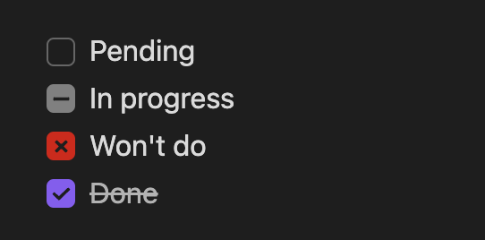

<h1>

Extended Task Lists
</h1>



### Features
- 🌟 Render in-progress and won't do task items with their own UI:
  - in-progress syntax: `- [.] In progress`
  - won't do syntax: `- [~] Won't do`
  - Now supports live preview mode (as of release 1.0.4)!
- 🌟 Generate a top-level TODO file by scanning all tasks lists in markdown files
  - Run using the command "Extended Task Lists: Update TODO"

### To use

#### Extra syntax
Simply add an in-progress or won't do task item: 

```markdown
- [ ] Pending
- [.] In progress 
- [~] Won't do
- [x] Done
```

#### Generate `TODO.md`
Open the command palette (`Ctrl/Cmd + P` by default) and run the "Extended Task Lists: Generate TODO" command.

The generated filename can be configured in the plugin settings, as well as what task item types are included. By default, done and won't do task items are excluded.

To exclude a markdown file's task items from being included in the generated TODO file, add `<!-- exclude TODO -->` anywhere in the markdown file. To exclude are markdown files in a folder, add an empty `.exclude_todos` file in the folder.

### Development

To get started, set up your local dev environment by following steps 1–3 in the [official Obsidian docs for building a plugin](https://docs.obsidian.md/Plugins/Getting+started/Build+a+plugin#Step+1+Download+the+sample+plugin).

Basically, the steps look like this:
```shell
mkdir -p extended-task-lists/.obsidian/plugins
cd extended-task-lists/.obsidian/plugins
git clone https://github.com/joeriddles/extended-task-lists.git
npm i
npm run dev
```

Then open the top-level `extended-task-lists/` folder in Obsidian as a new vault, enable community plugins in the settings, and enable the Extended Task Lists plugin.

Remember to run `npm run dev` while developing or you won't see your changes in Obsidian.

### Release

**Note: releases are now done using GitHub Actions and Releases.**

To update the package version:
```shell
npm version [major|minor|patch]
```

To create a release:
```shell
git tag x.y.z  # done by `npm version`
git push origin --tags
```
